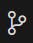

## Story
> As a contact center developer, I want to integrate Webex Contact Center SDK capabilities into a custom CRM application, so that agents can handle calls directly within their familiar business interface without switching between multiple applications.

!!! abstract w50 "Requirements"
    1. SDK Integration:
        - Initialize Webex Contact Center SDK with OAuth authentication
        - Register agent profile and retrieve available teams and login options
        - Handle agent login/logout operations
    2. Call Handling: 
        - Receive incoming call events and display call details
        - Provide call control functions (hold, resume, end)
        - Handle wrap-up codes and call completion
    3. CRM Integration:
        - Automatically search customer records when calls arrive
        - Display caller information and call associated details
    4. Real-time Updates:
        - Listen for agent state changes and task events
        - Update UI dynamically based on call status
        - Provide visual feedback for all operations

## Data and Actions

### Clone the repository with git
> Open Visual Studio Code
>
> Click the Source Control button in the left menu 
>
> Click Clone Repository
>
> Enter the repository source: <copy>https://github.com/shrishailsd/WX12025</copy>
>
> Select or create a new folder to clone the repository into.
>
> When prompted to open the cloned repository, select open.
> 
---

### Review the project structure and key files
> Once the project is opened in the VS code and examine the three critical files:
> > **banking-crm.html** - Contains the HTML structure for the CRM application  
> > **crm-app.js** - Handles CRM functionality and customer data management  
> > **wx1-sdk.ts** - Implements Webex Contact Center SDK integration  
>
> Navigate to line 198 in `banking-crm.html` to see how the LitElement web component is integrated within the CRM html template  
> Notice line 206
> ??? note w50 "LitElement Integration Example"
    ```html
    <wx1-sdk></wx1-sdk>
    ```
>
> ---

### Examine the SDK implementation architecture
> Open `wx1-sdk.ts` and review the class structure and key methods:
> > **@customElement("wx1-sdk")** - Defines the custom web component that you saw in previous step  
> > **@property({ reflect: true }) accesstoken** - Access token property binding  
> > **@state()** decorators - Component state management  
> > **startConnection()** - Initializes Webex SDK connection and obtains the webex object  
> > **getOptions()** - Sets up agent information from profile object and registers event listeners for call handling  
> > **actionTask()** - Handles call control operations like hold, resume, mute, unmute etc. 
>
> ??? question w50 "For example: Following are some of the SDK methods that are being used"
    - `this.webex.cc.register()` - Register to webex contact center to obtain agent profile details.
    - `this.webex.cc.on("AgentStateChangeSuccess", (event: any)` - Listen for events from webex contact center
    - `task.hold()`, `task.resume()`, `task.end()` - Call controls for hold, resume and end.
    - `this.task.wrapup({
                    wrapUpReason:`${aux2}`,
                    auxCodeId: `${aux1}`
                })` - Complete call with wrap-up reason
>
> ---

### Install dependencies and run the setup script
> Execute the setup script from terminal to check prerequisites and install dependencies:  
> <copy>./setup.sh</copy>  
> This script will:
> > - Verify Node.js installation  
> > - Install required npm packages  
> > - Set up TypeScript compilation  
> > - Configure the development server  
>
> ---

## Launch the CRM application
> From the terminal run 'npm run build', this will build your application. ensure there are no errors.
> Copy the ringtone.wav to dist folder using this command in terminal 'cp ringtone.wav dist'
> From the terminal run 'npm run dev', this will spin up your application automatically in the browser.

## SDK Authentication and Initialization

### Obtain and configure your access token
> Navigate to the [Webex Developer Portal](https://developer.webex.com/){:target="_blank"} and login using your agent credentials. On the right side top click on the avatar and copy the bearer token.  
> 
> In the CRM application interface, locate the access token input field  
> Paste the token you copied.
> ---

### Initialize SDK connection and retrieve agent profile
> Click the "start" button to initialize the SDK connection  
> The system will automatically:
> > - Validate your access token  
> > - pulls your desktop profile 
> > - Load available teams and telephony login options 
>
> ??? challenge w50 "What information is retrieved during agent registration?"
    The profile object contains multiple config entities but here the importnat ones we will be using for this lab:
    > - Agent name and ID
    > - Available teams
    > - Voice login options (BROWSER, AGENT_DN, etc.)
    > - Idle codes and wrap-up codes
    > - Dial number assignments
>
> ---

### Agent login process
> From the loaded profile information:
> > Select your assigned team from the teams dropdown  
> > Choose **AGENT_DN** as the login option  
> > Select your provided dial number: <copy><w class="dn">your-assigned-dn</w></copy>  
> > Click "Login" to establish your agent session , by default you will be in idle state.
>
> ---

## Call Handling Implementation

### Understanding the event-driven architecture
> The SDK uses an event-driven pattern for real-time updates from webex contact center.
> ??? note w50 "Key Event Listeners"
    ```typescript
    this.webex.cc.on("task:incoming", (task: ITask) => {

            Logger.webex('TASK-INCOMING', 'New incoming task received', { 
                taskUuid: (task as any).uuid, 
                ani: (task.data as any)?.interaction?.callAssociatedDetails?.ani 
            });
            this.task = task
            this.cad = Object.entries(this.task.data.interaction.callAssociatedDetails).map(([key, value]) => { return html`<p>${key}: ${value}</p>` })
            
            this.ani = this.task.data.interaction.callAssociatedDetails.ani
            Logger.debug('ANI-EXTRACT', 'Extracted ANI from task', { ani: this.ani });
            
            // Play incoming call audio notification
            this.playIncomingCallAudio();
            
            // Check if this is an outbound call we initiated - skip CRM search for outbound calls
            Logger.debug('OUTBOUND-FLAG', 'Checking isOutboundCall flag in task:incoming', { isOutboundCall: this.isOutboundCall });
            
            if (!this.isOutboundCall) {
                // Only search CRM for inbound calls
                Logger.info('CRM-SEARCH', 'Inbound call detected - performing CRM search');
                this.callCrmSearch(this.ani);
            } else {
                Logger.info('CRM-SEARCH', 'Outbound call detected - skipping CRM search');
            }
            
            // Check if browser login is selected to show answer/decline buttons
            const isBrowserLogin = this.agentLogin.loginOption === 'BROWSER';
            Logger.debug('LOGIN-OPTION', 'Checking login option for task controls', { 
                loginOption: this.agentLogin.loginOption, 
                isBrowserLogin: isBrowserLogin 
            });
            
            if (isBrowserLogin) {
                // Show answer/decline buttons for browser login
                this.tControls = html`
                    <button @click=${this.actionTask.bind(this, 'answer')}>Answer</button>
                    <button @click=${this.actionTask.bind(this, 'decline')}>Decline</button>
                `
                Logger.info('TASK-CONTROLS', 'Browser login detected - showing answer/decline buttons');
            } else {
                // For non-browser login (phone/desk phone), show incoming call message only
                this.tControls = html`<p>📞 Incoming call from ${this.ani} - Please answer on your phone</p>`
                Logger.info('TASK-CONTROLS', 'Non-browser login detected - showing incoming call message');
            }
            this.task.once("task:end", (task: ITask) => {
                Logger.webex('TASK-END', 'Task ended', { taskUuid: (task as any).uuid });
                // Stop incoming call audio when task ends
                this.stopIncomingCallAudio();
                
                // alert(`end ${JSON.stringify(task)}`)
                this.tControls = html`<select @change=${(e: any) => this.handleWrapupSelection(e)}>
                    <option value="">Select wrap-up reason...</option>
                    ${this.task.wrapupData.wrapUpProps.wrapUpReasonList.map((i:any)=>{return html`<option value=${i.id} data-name=${i.name}>${i.name}</option>`})}
                </select>`
            })
        })
    ```
>
> ---

### Test incoming call handling
> Change the agent state to available.
> Place a test call to your assigned number: <copy><w class="dn">your-test-number</w></copy>  
> Observe the automatic processes:
> > - Call details populate in the SDK component  
> > - ANI (caller number) is extracted and displayed   
> > - Call control buttons become available  
>
> ??? challenge w50 "How does the CRM integration work with incoming calls?"
    ```typescript
    this.webex.cc.on("task:incoming", (task) => {
        this.ani = task.data.interaction.callAssociatedDetails.ani;
        // Automatically trigger CRM customer search
        this.callCrmSearch(this.ani);
    });
    ```
>
> ---

### Implement call control operations
> Test each call control function during an active call:
> > **Hold** - Temporarily pause the call  
> > **Resume** - Reactivate a held call  
> > **End** - Terminate the call and initiate wrap-up  
>
> ??? question w50 "What happens when you end a call?"
    The system automatically presents a wrap-up code selection interface, requiring the agent to categorize the call before becoming available for new calls.
>
> When a call ends, the wrap-up selection interface appears:
> ??? note w50 "Wrap-up Implementation"
    ```typescript
    handleWrapupSelection(e: any) {
        const selectedValue = e.target.value;
        const selectedOption = e.target.selectedOptions[0];
        
        if (selectedValue && selectedOption) {
            const wrapupName = selectedOption.dataset.name;
            this.actionTask("wrapup", selectedValue, wrapupName);
        }
    }

    // SDK warpup method

    this.task.wrapup({wrapUpReason:`${aux2}`,
                      auxCodeId: `${aux1}`
                    })

    ```
> Select an appropriate wrap-up reason from the dropdown  
> The call will be completed and you'll return to available status  
>
> The SDK automatically tracks and responds to agent state changes:
> > - Login/logout events  
> > - Available/Idle events.
>
> ??? challenge w50 "How can you extend this to add custom state monitoring?"
    Add additional event listeners for specific state changes:
    ```typescript
            this.webex.cc.on("AgentStateChangeSuccess", (event: any) => {
            Logger.debug('AGENT-STATE', 'AgentStateChangeSuccess event', event);
            this.idleCode.value = event.auxCodeId
        });
    ```
>
> ---

## Testing and Validation

### Comprehensive call flow testing

> Before testing SDK with CRM, you need to configure the CRM with your phone number for automatic customer lookup and click to dial.
> Open `crm-app.js` and edit the customer record from line 40 with your details:
> ??? note w50 "Update Customer Record"
    ```javascript
    '1': {
        id: '1',
        firstName: 'john',         // Your FirstName
        lastName: 'smith',         // Your lastName
        phone: '(555) 987-6544',  // Replace with your ANI
        email: 'john.smith@email.com',
        address: '123 Main St, Anytown, ST 12345',
        dob: '1985-06-15',
        memberSince: '2020-03-10',
        notes: 'Preferred customer, has premium account package.'
    }
    ```
> Replace the firstName, lastName and phone number (the number you will be calling from)
>
> Perform end-to-end testing of the complete call workflow:
> > 1. Place an inbound call: <copy><w class="dn">test-number</w></copy>  
> > 2. Verify automatic customer lookup in CRM displays your updated record  
> > 3. Test all call control functions (hold, resume)  
> > 4. End the call from the phone you dialed in and complete wrap-up  
> > 5. Confirm return to available status  
>
> ---

### Browser login testing and comparison
> Now test the browser-based call handling functionality:
> > 1. **Logout** from your current agent session  
> > 2. **Login again** using the **'BROWSER'** option instead of AGENT_DN  
> > 3. **Repeat the complete call flow test** from above steps.
>
> ??? note w50 "Key Differences with Browser Login"
    When using BROWSER login option:
    > - **Answer/Decline buttons** appear for incoming calls
    - **Mute/Unmute functionality** is available during active calls
    - **Audio streams** are handled through WebRTC in the browser
    - **No physical phone** is required for call handling
>
> **Browser Login Test Steps:**
> > 1. Place an inbound call: <copy><w class="dn">test-number</w></copy>  
> > 2. **Click "Answer"** button in the SDK interface (not on a physical phone)  
> > 3. Verify **mute/unmute** buttons appear in call controls  
> > 4. Test **audio functionality** - speak and listen through your computer  
> > 5. Test **hold/resume** and **mute/unmute** functions  
> > 6. **End the call** using the interface and complete wrap-up  
>
??? challenge w50 "Compare the Two Login Methods"
    **AGENT_DN (Physical Phone):**
    > - Calls are answered on a physical desk phone/mobile
    - Limited browser-based call controls
    - Traditional telephony experience

    **BROWSER (Software):**
    > - Calls are answered directly in the web browser
    - Full WebRTC functionality with mute/unmute
    - Complete software-based call handling
    - Enhanced integration with CRM interface
> ---

### Advanced testing with browser console
> On your current session -
> > Open browser Developer Tools (F12)  
> > Navigate to the Console tab  
> > Repeat the call flow test from above  
> > Observe the SDK event logs, Filter console logs with [WX1-SDK] to see SDK related logs and [BANKING-CRM] to see CRM related logging  
> > Review the source code implementation during testing based on logs you see on the console.
>
> ---

### Test click to dial functionality
> Now test the outbound calling capability integrated into the CRM interface:
> > 1. **Ensure agent is logged in**  
> > 2. **Navigate to the CRM customer list** in the banking application  
> > 3. **Look for clickable phone numbers** (they should appear as blue, underlined links)  
> > 4. **Click on any phone number** that you added earlier to initiate an outbound call  
>
> ??? note w50 "Click-to-Dial Implementation"
    The CRM application automatically makes phone numbers clickable:
    ```javascript
        async placeClicktoDialcall(phone: string)

        //Following is the SDK method used for outdial call.
        await this.webex.cc.startOutdial(cleanedPhone);

    ```
>
> **Outbound Call Testing Process:**
> > 1. **Click a phone number** from the record that you updated with your phone number.
> > 2. **Observe the SDK console logs** showing outbound call initiation  
> > 3. **Verify call controls appear**, Click on answer button.
> > 4. **Note that CRM search is skipped** for outbound calls.
> > 5. **System will dial to your number**, Answer it.
> > 6. **disconnect** the call from phone.
>


> **Advanced Click-to-Dial Testing:** 
> > 1. **Verify error handling** - try clicking while already on a call  
> > 2. **Test with invalid numbers** - ensure proper error messages  
> > 3. **Check console logs** for detailed outbound call tracking  
>
??? question w50 "What validation occurs before placing an outbound call?"
    The `placeClicktoDialcall()` method performs several validations:  
    - Agent login status verification  
    - Phone number format validation and cleaning  
    - Existing call conflict detection  
    - SDK initialization check  
>
> **Browser vs Phone Login Differences for Outbound:**
> > - **BROWSER login**: Full WebRTC outbound calling through browser  
> > - **AGENT_DN login**: Outbound calls bridge through assigned desk phone  
> > - **Both modes**: Support click-to-dial from CRM interface  
> ---


