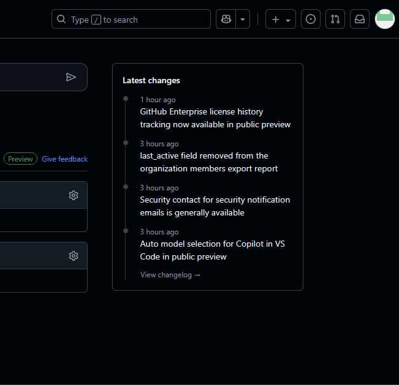
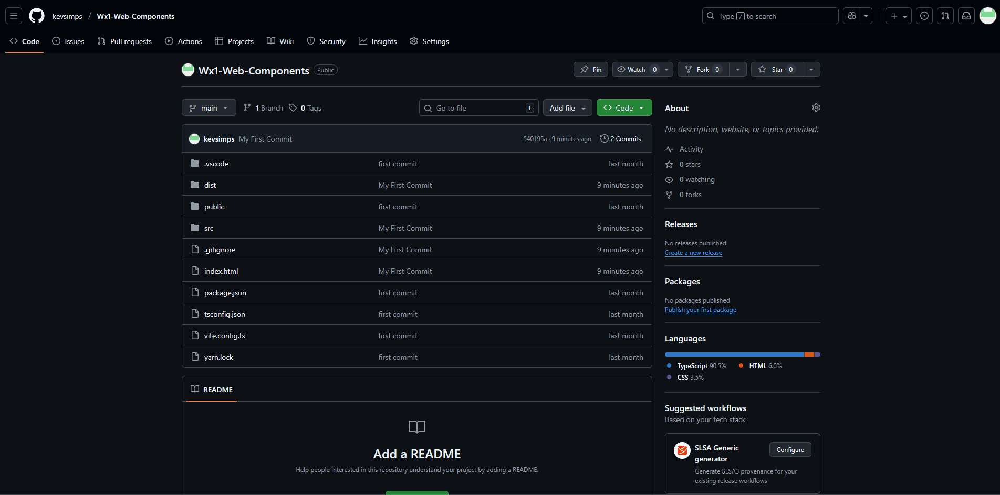
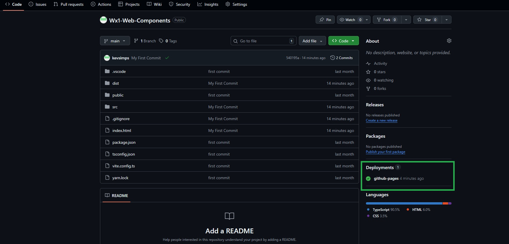

## Create an New Repository In Your Personal GitHub Account
> Log into your [GitHub Account](https://github.com){:tatget="_blank"}  
> ??? note w50 "In the upper right corner , click on the `+` menu then select New Repository"
    
> Fill in the details:  
>> Repository Name: <copy>Wx1-Web-Components</copy>  
>> Choose visibility: Public  
>> Add README: False  
>> Add .gitignore: No .gitignore  
>> Add license: No License  
>
> Click Create repository   
> Leave this tab open for use in future steps  
> 
> ---

<form id="info">
<label for="info">Enter your GitHub Account Information</label> 
  <label for="gh">GitHub Account:</label>
  <input type="text" id="gh" name="gh"> 
    <label for="ghEmail">GitHub Email Address:</label>
  <input type="text" id="ghEmail" name="ghEmail"> 
  <button onclick="setValues()">Update Lab Guide</button>
</form>

## Update the .gitignore file
> Open the .gitignore file in your project  
> Comment out `dist` (line 11) by placing your cursor on the line and using the keyboard shortcut using ctrl + /  
> Save the file (ctrl + s)  
> ---

## Update Git settings on the lab PC
> In the terminal of VS Code enter the following commands one at a time:  
> <copy>git config user.email "<w class="ghEmail"><w/>""</copy>  
> <copy>git config user.name "<w class="gh"><w/>""</copy>
>
> ---

## Remove the Current Remote Upstream Repository and Replace With Your New Repository
> In the terminal of VS Code enter the following commands one at a time:  
> <copy>git remote remove origin</copy>  
> <copy>git remote add origin https://github.com/<w class="gh">{githubAccount}</w>/Wx1-Web-Components.git</copy>  
> 
> ---

## Push Your Code
> In the terminal of VS Code enter the following commands one at a time:  
> <copy>git add .</copy>  
> <copy>git commit -m "My First Commit"</copy>   
> <copy>git push -u origin main</copy>  
>
> ---

## Option 1: Using Github Pages 
> In your github repository Click Seccings on the top ribbon  
> Select Pages on the left side menu  
> Under Branch, Select main  
> Leave /(root) selected  
> Click Save  
> ??? note w50 "Show Me"
    
> Click Code in the top ribbon  
> ??? note w50 "It will take a few minutes to publish the new site, refresh the page until you see the Deployments section populated like this"  
    
>
> ---

## Update You Desktop Layout JSON to Use the Hosted Version of your Web Components
> Open your Desktop Layout JSON on VS Code  
> Use the ctrl + f keyboard shortcut to find <copy>http://localhost:4173/index.js</copy>   
> Replace all instances with <copy>https://<w class="gh">yourGHAccount</w>.github.io/Wx1-Web-Components/dist/index.js</copy>  
> Save and Upload your Desktop JSON Layout  
> Login as an agent and test.  
> ---

## Option 2: Using JSDelivr (Demo Only)
> [Documentation](https://www.jsdelivr.com/documentation#id-github){:target="_blank"}  
> 

### Remove your Credentials from the lab PC
!!! note w50
    As this is a shared lab PC, we will remove your Github credentials from the Windows Credential Manager.  If you are completing this step on your own personal PC, you do not need to complete this step.
> Press the Windows key and type Credential Manager, and press Enter.  
> Click on "Windows Credentials".  
> Under "Generic Credentials", look for entries that start with git: or github.com (e.g., git:https://github.com).  
> Expand each relevant entry and click "Remove" or "Delete".  
> Confirm the deletion.  

