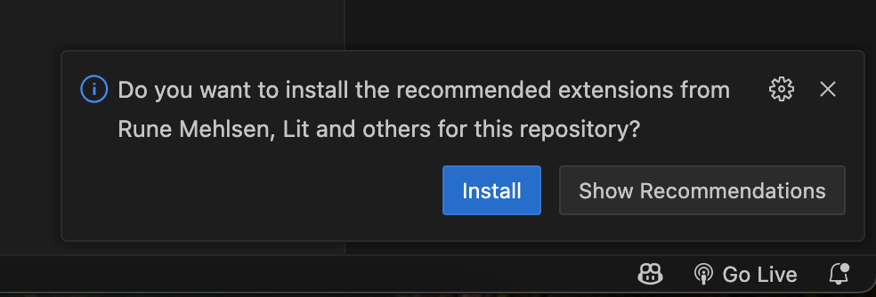
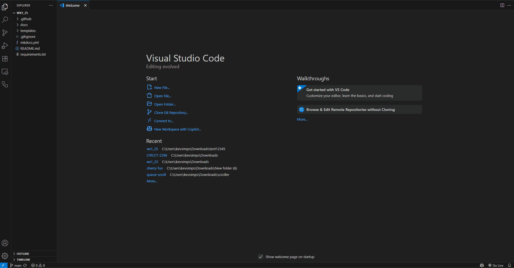

# Exploring Web Components

> In this lab you will be exploring how web components function and update in a simplified and isolated exercise.

### Clone the repository with git
> Open Visual Studio Code
>
> Click the Source Control button in the left menu 
>
> Click Clone Repository
>
> Enter the repository source: <copy>https://github.com/kevsimps/wx1-starter.git</copy>
>
> Select or create a new folder to clone the repository into.
>
> When prompted to open the cloned repository, select open.
> 
---

### Install the recommended extensions
> When you see the prompt to install recommended extensions in the lower right corner of VS Code, click install.
> {style="width:50%"}
>
---

### Build the environment

> Drag open the terminal at the bottom of the Visual Studio Code window
> 
> ??? Note "Show Me"
    
>
> In your terminal enter the following command:
>
> <copy>yarn</copy>
>
---

