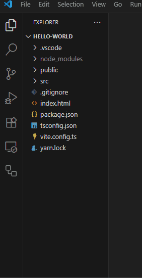
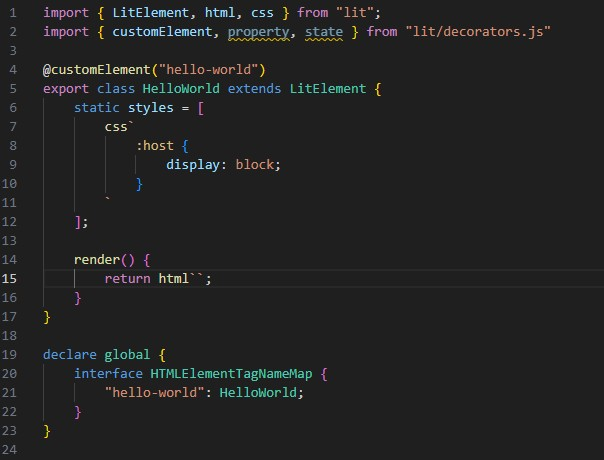
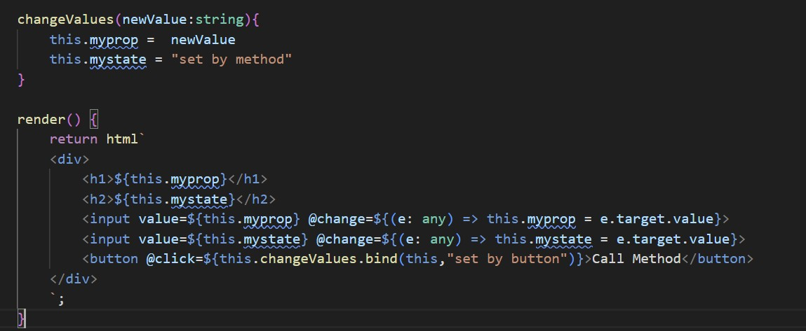

# Your First Web Component

<!-- > You are going to build a very basic web component  -->


## Create and scaffold a new file 
> Create a new file in the src directory named <copy>hello-world.ts</copy>
> ??? Note w50 "Show Me"
    
> In the new file type (not paste) littemplate
>
> Select the **Create LitElement Component With lit-html**
>
> ??? Note w50 "You should have a scaffold to build your new component"
    
>
> ---

## Add a new property and state
> Insert a line above Static Styles (line 6)
> 
> Add a new string property above the static styles: <copy>@property() myprop: string = "My Property"</copy>
>
> Add a new string state the line below the property you just added: <copy>@state() mystate: string = "My State"</copy>
>
> ---

## Add some HTML elements to the html template in the render method
> In the render() method add a few lines between the back ticks in of the ```return html`` ``` line
>
> On the line below ````return html` ````, add a div tag by typing: `<div>`
>
> Hit the enter button and add an h1 tag which will contain the value of the myprop property: `<h1>${this.myprop}</h1>`
>
> Below the h1 tag you just created, add the following code which includes:
> > An h2 tag with the value of mystate
> >
> > An input box with the value of myprop which will update the value of the property when the input box is changed  
> >
> > An input box with the value of mystate which will update the value of the state when the input box is changed 
>

```html
            <h2>${this.mystate}</h2>
            <input value=${this.myprop} @change=${(e: any) => this.myprop = e.target.value}> 
            <input value=${this.mystate} @change=${(e: any) => this.mystate = e.target.value}> 
```
> 
> ---


## Add some CSS to the static styles
> In the css template add these styles below the :host entry closing curly brace:
>
```CSS
            div{
                border:solid black 2px;
            }
            h1{
                color:blue;
            }
            h2{
                color:red;
            }
```
>
> ---


## Add your new component to the testing page
> Click on the index.html file in the explorer tab:
> 
> In the head section of the html:
> > Add a script tag under the existing script tag (if you type it, intellisense will help with the autocomplete options)
> >
```html 
<script type="module" src="/src/hello-world.ts"></script>
```
> > 
> > In the body section add your new custom element tag above the existing my-element custom element tag:
> >
```html 
<hello-world></hello-world>
```
>
>> Save the file (ctrl + s or File > Save)

> ---


## Start the development server and test
> In the terminal run the command <copy>yarn dev</copy>
>
> Open a browser tab to [http://localhost:5173/](http://localhost:5173/){:target="_blank"}
>
> ---

### Update values using the input boxes
> In the input box which has the value of My Property, change the value to: <copy>Prop From Component</copy>
>
> In the input box which has the value of My State, change the value to: <copy>State From Component</copy>
>
> ??? question w50 "What happens when you change the values in the input boxes?"
     When you click out of the input box or press enter, the UI updates with the new value.
>
> ---

### Add property and state declarations in index.html
> Inside the opening tag of hello-world add: <copy> myprop="set in html" mystate="set in html"</copy>
>
> Save the file (ctrl + s or File > Save)
> 
> ??? question w50 "What happens in your component?"
    The value of the property gets it's value from the parent Dom.  
    The value of the state does not update.
    ??? question "Why didn't the state update?"
        state is a private internal variable
>
> ---


<!-- ### Change the value of the passed property from the browser's developer tools -->

## Add a new method to change the values of myprop and mystate
> Above the render method create a new method called change values
>
> <copy>changeValues(){}</copy>
>
> ??? challenge w50 "Inside the curly braces, set the value of myprop and mystate to set by method"
    ```TS
        changeValues(){
        this.myprop = "set by method"
        this.mystate = "set by method"
        }
    ```
>
> ---
> 
## Add a button to call the new method when clicked
> Inside the html template below the input tags and still inside the div tags add this line:
> 
>  <copy>`<button @click=${this.changeValues}>Call Method</button>`</copy>
>
> Save the file
>
> Click the new Call Method button to test the functionality
> 
> ---

## Edit the changeValues method and Call Method button to pass a value and update the value of myprop
> Inside the parentheses of the changeValues method add a string variable named newValue: <copy>newValue:string</copy>
>
> Change the value you are setting this.myprop to: <copy>newValue</copy> 
>
> In the render method, change the @click listener to: <copy>${this.changeValues.bind(this,"set by button")}</copy>
>
> ??? code w50 "This is how your code should look"
    
> Save the file
>
> Click the Call Method button
>
> 


