## Story
> As a contact center administrator, I need to log out agents which have not logged out after their shift, so that the contact center reporting statistics are accurate. 

!!! abstract w50 "Requirements"
    1. Need a list of logged in agents which includes:
        - Agent name
        - Team name
        - Login time
        - Current Status
        - Last Activity time
    2. Need to be able to log out an agent

## Data and Actions

### Log into the Agent Desktop (so that you have data to query against)
> Launch the [Agent Desktop](https://desktop.wxcc-us1.cisco.com/){:target="_blank"}
>
> > Login: <copy><w>admin login</w></copy>  
> > Password: <copy><w>password</w></copy>  
> > Team: <copy><w>team</w></copy> 
> ---

### Use the Search API GraphQL Workbench to create the query for the Search API 
> Open the [Search API GraphQL Workbench](https://webexcc-sa.github.io/tools/gqlWorkbench/){:target="_blank"}
>
> > Use the Authorization Tool (Tools > Authorization)
> >> Login: <copy><w>admin login</w></copy>  
> >> Password: <copy><w>password</w></copy>
>>
>> ??? note w50 "Copy the authorization header into the environment variables"
    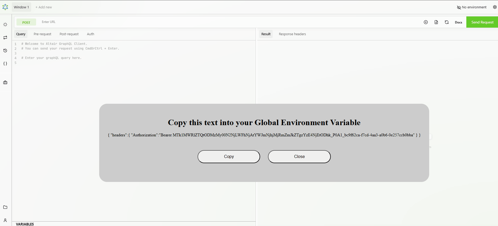
>
> > Set the URL: <copy>https://api.wxcc-us1.cisco.com/search</copy>
> 
> Open the Docs Panel 
> Click Query to see which fields are available  
> ??? question w50 "Which Fields are we going to use to find information about agents?"
    agentSession  
> Click on the blue text of the name of the field you want to use  
You can now see the Arguments and Fields available  
> ??? note w50 "Hover over the name of the fields you selected in the previous step at the top of the frame and the ADD QUERY button will appear, click it"
    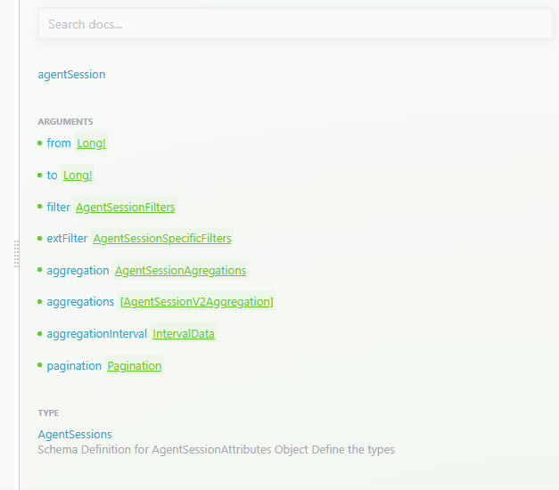
> You now have a query template in the first pane of Altair     
> ??? note w50 "Delete the "has" section and all of its fields"
    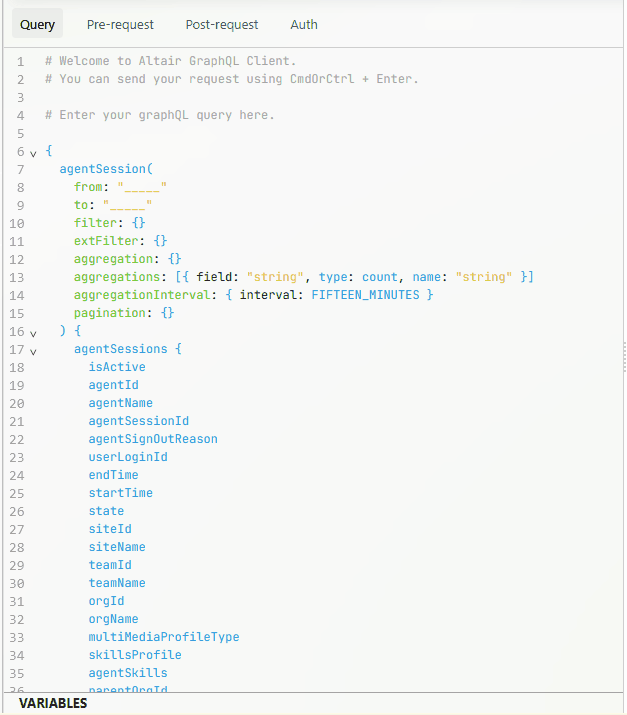
>
> In the Fields section of the query (agentSessions section):  
> > Delete the lines for intervalStartTime(sort: asc) and aggregation as we are not using them in this query.
> 
> In the Arguments section of the query (top section):
>> Delete the lines for aggregation, aggregations, and aggregationInterval as we are not using aggregations in this query.  
>
> ??? question w50 "Based on the requirements listed above in the story, what fields do you need to return in your query?"
     - Agent name = agentName
     - Team name = teamName
     - Login time = startTime
     - Current Status = channelInfo => currentState (note that this is not the same as the state field)
     - Last Activity time = channelInfo => lastActivityTime
    ??? note "currentState and lastActivityTime have a special method of being addressed in the query"
        ```GraphQl
        channelInfo{
            currentState
            lastActivityTime
        }
        ```
        Update the channelInfo fields in the query.
>
> ??? note w50 "Use the Time Widget in the Graph QL Workbench to update the Arguments section of the query selecting From: 1 day ago and To: Now.  Then copy the values into the query."
    
>
> Press the green Send Request button  
> Scroll through the results in the middle pane of Altair  
> > Note that there is a lot of extra information you will not need to satisfy the requirements. 
>
> Add filters to the Arguments section of the query to only return agent data for agent which are currently active (logged in) and only return the status information for the telephony channel
> Inside the curly braces after filter add this compound filter  
> ```GraphQL
    and:[
      {isActive:{equals:true}}
      {channelInfo:{channelType:{equals:"telephony"}}}
    ]
  ```
> 
> Press the green Send Request button 
>> Note there are still fields you will not need to satisfy your requirements

> Comment out any fields you will not need by using ctrl + / in front of the field name (you can comment more than one line at a time by selecting multiple lines)  
> Press the green Send Request button to see the results.
> 
> Do not close this tab as you will be using it in an upcoming step
> 
> ---

### Use API to log out agents
> Navigate to the [Agent Logout API documentation](https://developer.webex.com/webex-contact-center/docs/api/v1/agents/logout){:target="_blank"}
>
> Log into the developer portal using your admin credentials  
> > Login: <copy><w>admin login</w></copy>  
> > Password: <copy><w>password</w></copy> 
>
> In the logoutReason field enter <copy>Admin Logout</copy>
> 
> In the search API results in the the GraphQL Workbench, find your agent's information.
> ??? question w50 "Do you have all of the data we need to to make the logout API call?"
    You will also need the agentID of the agent you want to log out.  
    > Uncomment out agentId in the fields of the GQL query if they were previously commented out and rerun the request
> Enter your agent's agentId in the agentId field  
> Click on the option to see the Request Body (JSON)  
> Click on the RUN button
>> You should receive a 202 response  
> 
> Do not close this tab as you will be using it in an upcoming step  
>
> ---

## Creating the Web Component
> Now that you have the basic data and API elements understood and tested, it is time to put them together in code and orchestrate a good experience.

### Create a new Web Component
> Create a new file in the src directory named <copy>admin-actions.ts</copy>
> 
> In the new file type (not paste) littemplate
>
> Select the **Create LitElement Component With lit-html**
> 
> ---

### Add a string Property to hold your Access Token
> <copy>@property() token?: string</copy>
>
> ---

### Add an array State to hold the data you will return in the query
> <copy>@state() agentList = []</copy>
>
> ---

### Create an Async method to call the search API
> <copy>async getAgents(){}</copy>

### Refactor and Export your Graph QL Query
> ??? note w50 "In your GraphQL Workbench browser tab, click on the "suitcase" icon on the left menu bar then click Refactor Query"
    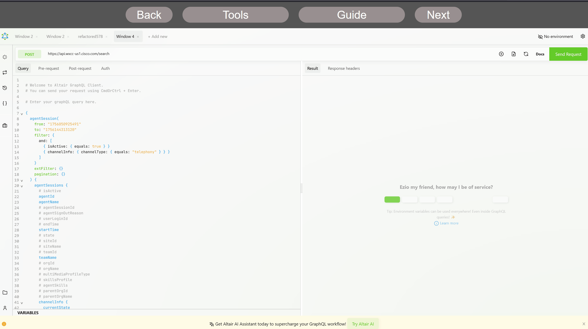
> 
> Change the name of the query from refactored### to: <copy>activeAgents</copy>  
> Compress the query (suitcase menu > Compress)  
> Copy as cURL (suitcase menu > Copy as cURL)  
> ??? note w50 "Show me the steps"
    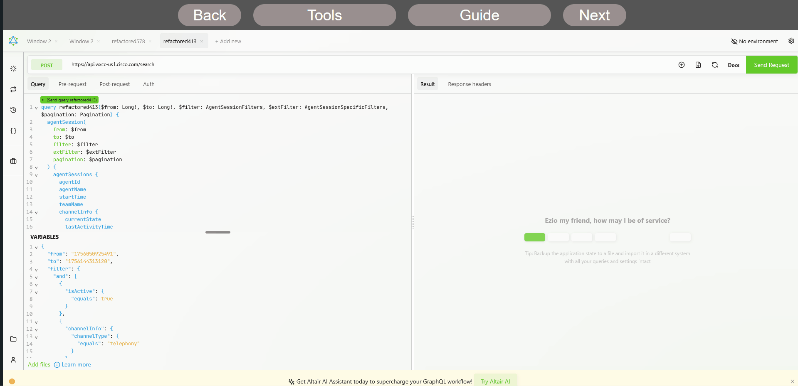
>
> ---


### Import cURL into Postman
> Open Postman
> Click Import  
> ??? note w50 "Paste the cURL from the GraphQL Workbench into the import text box"
    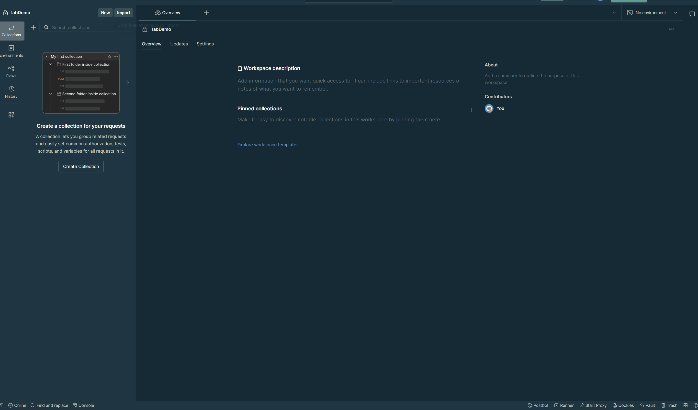
>
> ---

### Update Headers in Postman
> Uncheck all headers except: Content-Type and Accept  
> Add an Authorization Header:  
> > Key: <copy>Authorization</copy>  
>> Value: <copy>Bearer placeHolder</copy>
>
> ---

### Format the request Body
> Click on Body  
> Click the Text dropdown and select JSON  
> Click Beautify  
>
> ---

### Turn the request into code  
> Click the Code button  
> Select JavaScript - Fetch for the language  
> Click the settings cog and ensure the Use async/await is toggled on  
> Copy the code using the copy button.  
>
> --- 

### Add the code to the getAgents method and make these changes
> Between the curly braces of the getAgents method, press enter then paste the copied code from postman  
> In the headers section of the method, find the Authorization header and change "Bearer placeHolder" to <copy> ```Bearer ${this.token}` ``</copy>  
> In the **raw** section which holds the stringified JSON:
>> Change the from variable value to represent a time 24 hours (86400000 ms) before the current time (Date.now()) using a string literal expression: <copy>```${Date.now() - 86400000}` ``</copy>  
>>
>> Change the to variable value to represent the time now: <copy>```${Date.now()}` ``</copy>  
>
> Make requestOptions an object type by adding <copy>: object</copy> after its name and before the equals sign
>
> In the try section of the method:  
>> Change result to equal: <copy>response.json()</copy> instead of response.text()  
>
> ---

### Return to the GraphQL Workbench to understand how to use the returned data
> In the center pane of Altair, copy the data returned from the query  
> Open [JSON Path Finder](https://jsonpathfinder.com){:target="_blank"}  
> Paste the copied data into the left pane  
> In the right pane, navigate until you find the array of agentSessions  
> ??? question w50 "What is the JSON path which will return the array of agentSessions?"
    x.data.agentSession.agentSessions
    ??? challenge "In the agent-actions.ts file, set the value of agentList to this JSON path"  
        Add <copy>this.agentList = result.data.agentSession.agentSessions;</copy> in the try section of the getAgents method, below the **const result = await response.json();** line
        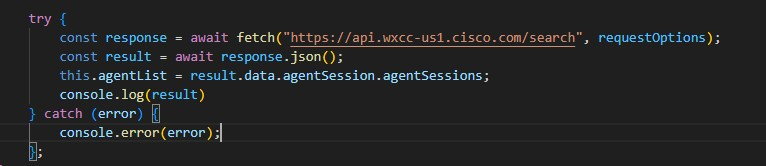
>
> Back in JSON Path Finder, make the data mimic what you set agentList to in the previous step and only keeping the agentSessions array
>> On line 4 double click next to the opening bracket of agentSessions to select the entire array.  
>> Copy the array (ctrl + c)  
>> Delete all the data (ctrl + a and delete)  
>> Paste the previously copied array (ctrl + v)
>> ??? note w50 "Show me"
    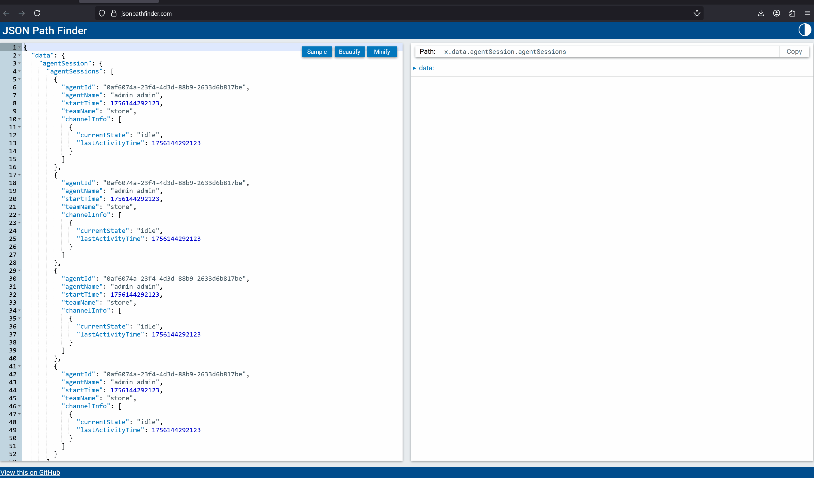
>
> ---

### Update the html template in the render method
> In the render() method add a few lines between the back ticks in of the ```return html`` ``` line  
> Add an title header for the web component: <copy>`<h1 class="title">Admin Actions</h1>`  
> Add a button to call the getAgents method: <copy>`<div><button @click=${this.getAgents}>Refresh Agent List</button></div>`</copy>  
> Create a table with headers for Agent Name, Team, Login Time, and Status  
>> Add a `<table>` tag  
>> Inside the table tags add a table head tag `<thead>`  
>> Inside the table head tag add table headers for the table as listed above.  Example: <copy>`<th>Agent Name</th>`</copy>
> ??? note w50 "Check your code"
    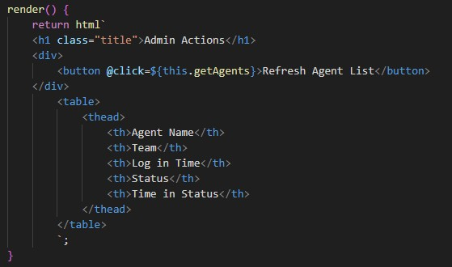
>
> ---

### Create the table body using the data from the agentList array
> In this section you are going to use the map method which will preform an action for each object in an array.  Each iteration of the map method will produce an object from that index of the array which you will refer to as t and will represent the root of the JSON path.  You will be using JSON Path Finder to understand the JSON path addresses as you progress through the fields.  You will also be doing some math and other formatting to the returned values to produce a more user friendly table.

### Create the map method to render the html of the table body
>   
```TS
    ${this.agentList?.map((t: any) => html`
    <tbody>

    </tbody>
    `)}
```
>
> ---

### Inside the tbody tags create the table data cells
> Using JSON Path Finder, Create the field for agentName  
> > <copy>`<td>t.agentName</td>`</copy>>  
> ??? challenge w50 "Create the field for Team  "
    <copy>`<td>t.agentName</td>`</copy>>  
> Create the value of startTime in a human readable datetime stamp  
> > <copy>`<td>${new Date(t.startTime).toLocaleString()}</td>`</copy>  
> ??? challenge w50 "Create the value of currentState" 
    <copy>`<td>${t.channelInfo[0].currentState}</td>`</copy>
> Create the duration of time in the current state  
> > <copy>`<td>${new Date(Date.now() - t.channelInfo[0].lastActivityTime).toISOString().slice(11, -5)}</td>`</copy>
>
> ---

### Add to index.html passing the Bearer token as a property
> ??? challenge w50 "Add the script tag in the header of index.html"
    <copy>`<script type="module" src="/src/admin-actions.ts"></script>`</copy>
> ??? challenge w50 "Add the custom element tag to the html body of index.html"
    <copy>`<admin-actions token="Replace with the token value from the GraphQL Workbench"></admin-actions>`</copy>
>
> ---

### Make the output look a better by adding this CSS to the static styles:
> ```CSS
            :host{
            display: flex;
            flex-direction: column;
            border: solid 3px var(--md-primary-text-color);
            padding: 2em;
            color:var(--md-primary-text-color)
            }
            .title{
            text-align: center
            }
            table{
            display:table;
            border-collapse:collapse;
            border-spacing: 0;
            margin-top: 15px;
            }
            tr, th, td{
            border: solid 1px;
            text-align: center;
            }
            .hidden{
            display:none;
            }
  ```
>
> ---

### Convert the Logout Agents API call into code
> In the browser tab with the developer portal open to the agent logout API:  
>> Click on Code Snippets  
>> Select Curl  
>> Click the Copy button in the upper right corner of the code   
>  Open Postman and import the cURL  
>> Click the code button in Postman
>>> Make sure that you have selected Javascript - Fetch with async/await  
>> Copy the code  
>
> ---

### Create a new async method to log out agents
> <copy>async logOutAgent(e: any){}</copy>  
> Between the curly braces, press enter then paste the copied code from postman.  
> Make the following edits to the method code:  
>> Change the Authorization header to use the token property  
>> Make requestOptions an object type  
>> Change the agentId in the raw variable to use <copy>`e.target.value`</copy>
> ??? note w50 "Check your code"
    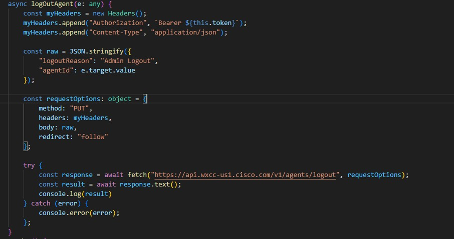

> 
> ---


### Add a button to log out the agent in every row of the table
> Add a header to the bottom of the `<thead>` section: <copy>`<th>Action</th>`</copy>  
> Add another column to the table data map at the bottom of the `<tbody>` section:  <copy>`<td><button value=${t.agentId} @click="${this.logOutAgent}">Log Out</button></td>`</copy>
> ??? note w50 "Check your code"
    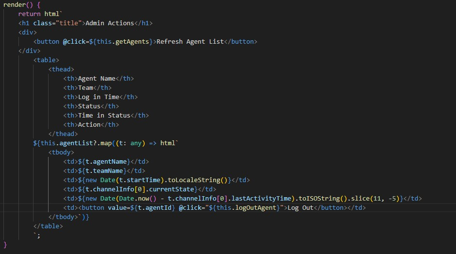

>
> ---

Desktop Layout


