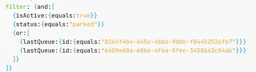

## Story
> As a contact center director, I want my agents to have scrolling text on their agent desktop with call queue statistics for calls which they are eligible to receive, so they can see them without looking at another screen.

!!! abstract w50 "Requirements"
    1. Queues the agent is eligible to receive calls from:
        - Queues which include the agent's team
        - Direct skilled queues where the agent's skills match
        - Agent assigned queues where the agent is assigned
    2. For all calls: 
        - List the queue name
        - List the number of calls
        - Show the longest wait time in queue
    3.  Queue statistics should scroll on the agent desktop
        - Data should update automatically

## Data and Actions

### List all queues assigned to the agent by the team they are logged into
> Navigate to the [List references for a specific Team API](https://developer.webex.com/webex-contact-center/docs/api/v1/team/list-references-for-a-specific-team){:target="_blank"}  
> Get your team ID from Control Hub  
> Click to run the request  
> Copy the cURL and import it into Postman
>
> ---

### List all skilled queues from which the agent can receive calls
> [List skill based Contact Service Queue(s)by user ID](https://developer.webex.com/webex-contact-center/docs/api/v1/contact-service-queues/list-skill-based-contact-service-queuesby-user-id){:target="_blank"}  
> Get your userId from Control Hub
> Click to run the request  
> Copy the cURL and import it into Postman
>
> ---

### List all queues in which the agent is directly assigned
> [List agent based Contact Service Queue(s)by user ID](https://developer.webex.com/webex-contact-center/docs/api/v1/contact-service-queues/list-agent-based-contact-service-queuesby-user-id){:target="_blank"}
> Using the same userId as the previous request  
> Click to run the request  
> Copy the cURL and import it into Postman
>
> ---

??? question w50 "Did you notice anything interesting about the API calls and responses?"
    - All three use the same method (GET)
    - The returned JSON has nearly the same structure
    - All three calls are using the same headers
    - All three are using the same URL root
Keep Postman open as we will be using the information in a future step

---


### Use the Search API to retrieve the number of contacts and oldest contact createdTime for the queues which the agent is assigned
For this query you will be using aggregations and a compound filter to retrieve the queue statistics.  
> Open the [Search API GraphQL Workbench](https://webexcc-sa.github.io/tools/gqlWorkbench/){:target="_blank"}  

> === "If your previous session is still valid"
     Click the Add New button  
> === "If your previous session is no longer valid"
      Use the Authorization Tool (Tools > Authorization)
     > Login: <copy><w>admin login</w></copy>  
     > Password: <copy><w>password</w></copy>
    >
    ??? note w50 "Copy the authorization header into the environment variables"
        
    Set the URL: <copy>https://api.wxcc-us1.cisco.com/search</copy>  
> Open the Docs pane and add the query for task using the ADD QUERY button  
> Remove the has section  
> Remove the intervalInfo and pageInfo sections  
> Remove all fields in the tasks section except lastQueue and aggregation  
> After lastQueue add: <copy>{name}</copy>  
> After aggregation add: <copy>{name value}</copy>
> In the Arguments section of the query, remove the lines for aggregation, aggregationInterval, and pagination  
> Click the suitcase icon and select Prettify  
> 
> ---

#### Creating the aggregations
An Aggregation can return a count, sum, average, max, min, or cardinality of a field along with a name you provide.  They can also have their own set of filters which can be used to further refine the data into the information you require.   
In their most basic form an aggregation is represented like: `{ field: "string", type: count, name: "string" }` inside an array.
They can be further bifurcated by having other fields in the query.  In our case we are going to slice our aggregations based on the lastQueue where they were assigned.  
> ??? challenge w50 "Create an aggregation to return the count of contact"  
    { field: "id", type: count, name: "contacts" }
    > We are returning the count of the task IDs and naming is "contacts"
> Replace the aggregating template example in the query with your new aggregation leaving the square brackets. Then press enter twice to move the closing square bracket down to make room for the next aggregation.
> ??? challenge w50 "Create an aggregation to return the min createdTime and name it oldestStart"
    { field: "createdTime", type: min, name: "oldestStart" }
> Add this aggregation directly below the one you just created.
> Prettify your query. 
>
> ---


#### Creating the compound filter
In the previous lab, you used an **and** filter group to exclude records and fields which did not match the filter criteria.  In this query you will be nesting an inclusive **or** filter group inside an excluding **and** filter group.
> Inside the curly braces of the filter, type: `and:[]`, then press enter between the square brackets  
> ??? challenge w50 "How would you add a filter if you only want to return contacts which are active?"
    `{isActive:{equals:true}}`
> After adding the previous filter, on the next line type: `{or:[]}`, then press enter between the square brackets.  
> Using the Queue IDs returned from the List references for a specific Team API query you have in Postman:  
>> For each of the Queue IDs add a new filter inside the or square brackets with the Queue ID inside the quotes for equals:  
>> <copy>`{lastQueue:{id:{equals:""}}}`</copy>  
>> ??? note w50 "Check your filters"
    
>
> ---

#### Testing the query
> Place a call to your assigned inbound number: <copy><w class="dn"></w></copy>  
> > You can mute the volume for the call as you will not actually be answering the call.  
> 
> Use the time tool to set the from: 1 day ago and to: Now  
> Press the Send Request button  
> You can end the call once your query has returned the results  
> ---

#### Optimizing and exporting the query
> Using the options in the suitcase menu
> > Refactor the query  
> > Rename the query to <copy>queueStats</copy>  
> > Export the cURL and import it into Postman
>
> Do not close the browser tab
>
>  In Postman:
> > Uncheck all headers except: Content-Type and Accept  
> Add an Authorization Header:  
> > Key: <copy>Authorization</copy>  
>> Value: <copy>Bearer placeHolder</copy>  
> Change the body type to JSON and Beautify it  
> ---


## Creating the Web Component

### Create a new Web Component
> Create a new file in the src directory named <copy>queue-scroll.ts</copy>
> 
> In the new file, type (not paste) littemplate
>
> Select the **Create LitElement Component With lit-html**
> 
> ---

### Create Properties for the required variables
> <copy>@property() token?: string</copy>  
> <copy>@property() orgId?: string</copy>  
> <copy>@property() teamId?: string</copy>  
> <copy>@property() agentId?: string</copy>  
>
> ---

### Create States for the required data elements
> <copy>@state() queueStats = []</copy>    
> <copy>@state() queueFilter = []</copy>    
>
> ---

### Create a new async method to query the Search API
> <copy>async getStats(){}</copy>  
> In Postman, use the code feature to generate a JavaScript - Fetch using the async/await options and press copy  
> Between the curly braces of the getAgents method, press enter then paste the copied code from postman  
> In the headers section of the method, find the Authorization header and change "Bearer placeHolder" to <copy> ```Bearer ${this.token}` ``</copy>  
> In the **raw** section which holds the stringified JSON:
>> Change the from variable value to represent a time 24 hours (86400000 ms) before the current time (Date.now()) using a string literal expression: <copy>```${Date.now() - 86400000}` ``</copy>  
>>
>> Change the to variable value to represent the time now: <copy>```${Date.now()}` ``</copy>  
>
> Set the **type** of requestOptions to be an object by adding this notation, after its name and before the equals sign: <copy>`: object`</copy>  
>
> In the try section of the method:  
>> Change result to equal: <copy>response.json()</copy> instead of response.text()  
> ---

#### Return to the GraphQL Workbench to understand how to use the returned data
> In the center pane of Altair, copy the data returned from the query  
> Open [JSON Path Finder](https://jsonpathfinder.com){:target="_blank"}  
> Paste the copied data into the left pane  
> In the right pane, navigate until you find the array of queues and their aggregations   
> ??? question w50 "What is the JSON path which will return the array of queues and their aggregations?"  
    x.data.task.tasks
> ??? question w50 "What is the JSON path for the value of the queue name in the first array item?"
    x.data.task.tasks[0].lastQueue.name
> ??? question w50 "What is the JSON path for the value of the oldestStart aggregation in the first array item?"
    x.data.task.tasks[0].aggregation[0].value
> ??? question w50 "What is the JSON path for the value of the number of contacts in the first array item?"
    x.data.task.tasks[0].aggregation[1].value
> ---

#### Use map to create an unordered list item for each item returned in the query
In this line of code you are going set the value of the state **queueStats** using map on the JSON results from the Graph QL query. For each item in the array of queue information, you are going to create a list item of an unordered list using an html template.  Each list item will include; the queue name, number of contacts, and how long the contact has been in the queue. 
> In the try section of the getStats method, below the line `const result = await response.json();`:  
> ??? challenge "Insert this updated line of code using the information from JSON path Finder:<br> this.queueStats = await result.(JSON path to the array items).map((item: any) =>{})"
    <copy>this.queueStats = await result.data.task.tasks.map((item: any) => {})</copy>
> !!! challenge "In the curly bracket of the arrow function use insert this html template then update the template to use the array values:"  
    <copy>``return html`<li> | Queue: ${<replace with queue name>} Contacts: ${<replace with the count of contacts>} Wait: ${new Date(Date.now() - <replace with the oldestSrart time>).toISOString().slice(11, -5)} |</li>` ``</copy>
    ??? answer
        <copy>``return html`<li> | Queue: ${item.lastQueue.name} Contacts: ${item.aggregation[1].value} Wait: ${new Date(Date.now() - item.aggregation[0].value).toISOString().slice(11, -5)} |</li>` ``</copy>
> ---

### Update the render method
Add this code, which includes an unordered list and a temporary testing button, into the html template of the render method.
!!! blank w50 ""
    ```TS
            <button @click=${this.getStats}>test</button>     
            <div class="marquee-container">
                <ul class="marquee">
                    ${this.queueStats}
                    ${this.queueStats}
                </ul>
            </div>
    ```

### Add to index.html
> In the index.html:  
??? challenge w50 "Add the script tag for this web component into the header"
    <copy>`<script type="module" src="/src/queue-scroll.ts"></script>`</copy>
??? challenge w50 "Add the web component's html tag and pass the property values for token, orgId, teamId, and agentId"
    Fill in the empty values:  
    <copy>`<queue-scroll token="" orgId="" teamId=""  agentId=""></queue-scroll>`</copy>

#### Testing


### Create a new async method to aggregate a list of queues for the agent signed in and update the query filter with those queue values

!!! abstract w50
    There are three APIs you will need to call in order to retrieve a full list of queues from which the agent may receive calls.  However, this does not mean that you will need three different methods added to your web component, and with the URL paths and returned JSON being very similar, you have the ability to reuse code.

    The URLs are formatted with the root: `https://api.wxcc-us1.cisco.com/organization/{orgId}`  
    And the paths:  
    `/team/{teamId}/incoming-references`  
    `/v2/contact-service-queue/by-user-id/{agentId}/skill-based-queues`  
    `/v2/contact-service-queue/by-user-id/{agentId}/agent-based-queues`  


> <copy>async getQueues(){}</copy>  
> In Postman, copy the code (Javascript - Fetch with async/await) for the List references for a specific Team API call 
> Between the curly braces of the getAgents method, press enter then paste the copied code from postman  
> ??? challenge w50 "Update the Authorization header to use the property token"
    <copy> ```Bearer ${this.token}` ``</copy>  
> Bellow the headers, add a new constant which holds an array of the URL paths:  
> > <copy>``const paths = [`/v2/contact-service-queue/by-user-id/${this.agentId}/agent-based-queues`, `/v2/contact-service-queue/by-user-id/${this.agentId}/skill-based-queues`, `/team/${this.teamId}/incoming-references`]``</copy>  
>
> On the next line, make sure that the state queueFilter is an empty array before you add values by setting like this: <copy>this.queueFilter = []</copy>  
> Set the **type** of requestOptions to be an object by adding this notation, after its name and before the equals sign: <copy>`: object`</copy>  

!!! abstract w50
    In the next steps you will use a forEach method iterate through the **paths** array, making an API call "for each" path in the array.  During each iteration you will use another forEach method to iterate through the returned data, then add a formatted object to the queueFilter array.  After creating the queueFilter, you will call the getStats() method to populate the queue information.

> Wrap the try/catch section in a forEach method:  
> > On the line above the try, insert: <copy>`paths.forEach(async (path, i) => {`</copy>  
> > Below the closing curly brace of the catch. insert: <code>`})`</code>  
> 
> Change the URL in the fetch command to <copy>`` `https://api.wxcc-us1.cisco.com/organization/${this.orgId}${path}` ``</copy>  
> Change result to equal: <copy>response.json()</copy> instead of response.text()  
> Add the forEach to iterate through the returned data and push the formatted object into the queueFilter array:  
> > <copy>result.data.forEach((q: any) => this.queueFilter.push({ lastQueue: { id: { equals: q.id } } }))</copy>  
>
> After the closing curly brace of the catch and before the closing `})`, add an if statement to check if the forEach method has completed so that you can call the getStats method and populate the UI:  
> >  <copy>if (i >= paths.length - 1) {this.getStats()}</copy>
> ---


### Update the get Stats method to use the new filter
> In the getStats method, find the or filter group in the query variables:  
> > Replace the square braces and JSON contained in the square braces with: <copy>this.queueFilter</copy>
> ??? note w50 "Show me"
    
> ---

### Update the testing button in the render function
> In the html template of teh render function:  
> > change the @click from this.getStats to <copy>this.getQueues</copy>  
> ---

### Add CSS Styling
> Replace the static CSS with this CSS  
> !!! blank w50 ""
    ```CSS
                :host {
                display: flex;
                }
                .marquee-container {
                width: 30vw;
                height: 50px; /* Set a fixed height for the container */
                overflow: hidden; 
                border:solid;
                border-radius:25px;
                }

                .marquee {
                list-style: none; /* Remove default list styles */
                display:flex;
                padding: 0;
                margin: 0;
                height:100%;
                width:max-content;
                animation: scroll linear infinite;
                animation-duration: 10s;
                align-items:center;
                }
                .marquee li {
                display:flex;
                align-self:center;
                align-items:center;
                justify-content:center;
                flex-shrink:0;
                font-size:2rem;
                white-space:nowrap;
                padding: 0 1rem 0 1rem;
                }
                .marquee:hover{
                animation-play-state: paused;
    
                }

                @keyframes scroll {
                0% {
                    transform: translateX(0); /* Start position */
                }
                100% {
                    transform: translateX(-50%); /* End position (fully scrolled) */
                }
                }
    ```
> ---

#### Testing 
> Call your assigned DN to place a call in the queue <copy><w class="dn">dn</w></copy>  
> Once the call is in queue, press the testing button  
> > You should see the queue stats scrolling in your web component.
>
> ---
### Add auto load and refresh functionality
!!! abstract w50
    - Instead of updating the widget data only when you push a button, you can execute your code automatically once the web component is loaded using the **connectedCallback** lifecycle.  
    - You can also employ the **setInterval** method to run parts of your code on a set interval to refresh your data.  
    - Since the queues the agent is assigned are not likely to change often, you only need to execute getQueues when the agent logs in.
    - If you are setting up event listeners or timers via **connectedCallback**, it is a best practice to remove them from memory when you unload the web component using the **disconnectedCallback** lifecycle.  In order to clear the setInterval, you will create a state so that you can reference it with later.  

> Add a new state <copy>@state() _timerInterval?: any </copy>  
> Add the connectedCallback and disconnectedCallback methods  
> !!! blank w50 ""
    ```
        connectedCallback() {
            super.connectedCallback()
            this.getQueues()
            this._timerInterval = setInterval(() => this.getStats(), 10000);
        }
        disconnectedCallback() {
            super.disconnectedCallback();
            clearInterval(this._timerInterval);
        }
    ```

> Remove the testing button
> Save and test by placing a call into your DN.  
> ---


### Adjust the scrolling and refresh time to account for the number of queues displayed
!!! abstract w50 
    You may have noticed that the scroll speed and refresh rates are static.  That means that regardless of how may queues you are displaying stats for, it will scroll by in 10 seconds and it will refresh the data every 10 seconds.  In this step, you are going to further enhance the functionality by making the scroll speed appear consistent by making the total scroll time a variable.  You are also going to set the data refresh rate to use the same dynamic time so that you are able to display all of the stats before restarting the scroll with new data.  

> Add a new state to hold the refresh time: <copy>@state() refreshTime = 10</copy>  
> Add a new method to calculate and update the refreshTime (10 seconds per queue returned) as well as update the _timerInterval with a new setInterval
> !!! blank w50 ""
    ```TS
    updateInterval(){
        if(this.queueStats.length >=1){
            this.refreshTime = this.queueStats.length * 10
        }else{
            this.refreshTime = 10
        }
        clearInterval(this._timerInterval)
        this._timerInterval = setInterval(() => this.getStats(), this.refreshTime * 1000);
    }
    ```
> Remove the `this._timerInterval = setInterval(() => this.getStats(), this.refreshTime * 1000);` line from the connectedCallback method  
> In the getStats method, below where you are setting queueStats, call updateInterval: <copy>this.updateInterval()</copy>  
> In the html template of the render method, in the opening ul tag, override the static CSS by adding: <copy>style="animation-duration: ${this.refreshTime}s"</copy>  
> ---


### Add to Desktop Layout


## Testing